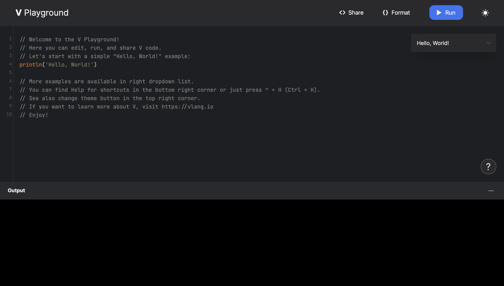

# V Playground: Run, Edit, Share V Code Online

This repository contains the source code for V's playground (play.vlang.io).



## Developing

### Quick, containerized local development (recommended)

#### Using Docker Compose

```bash
git clone https://github.com/vlang/playground
cd playground
docker-compose up -d
```

then access the playground at <http://localhost:5555>

### Using VSCode DevContainers

1. Install Docker
2. Install [Visual Studio Code](https://code.visualstudio.com/)
3. Install the [Remote Development](https://marketplace.visualstudio.com/items?itemName=ms-vscode-remote.vscode-remote-extensionpack) extension for VS Code
4. Clone <https://github.com/vlang/playground>
5. Create your application within a container (see gif below)

Done. And your system will remain "clean".


Then just run

```sh
make run
```

then access the playground at <http://localhost:5555>

### Run the playground locally (not recommended)

> NOTE: This is not recommended, as it requires you to install V and all of its dependencies manually. Only works on Linux.

#### Install Dependencies

> We use isolate to sandbox the playground, so you need to install it first.

```bash
git clone https://github.com/ioi/isolate /tmp/isolate
cd /tmp/isolate
make isolate isolate-check-environment
make install
```

### Run the server

```bash
git clone https://github.com/vlang/playground
cd playground
v run server.v
```

then access the playground at <http://localhost:5555>
